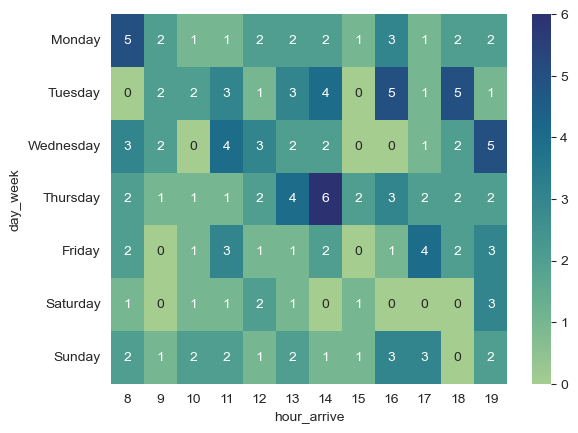
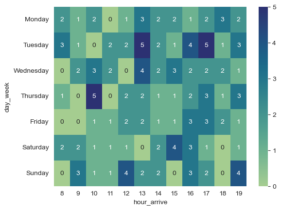
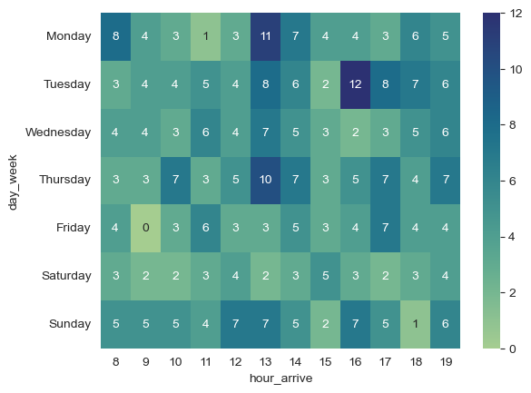
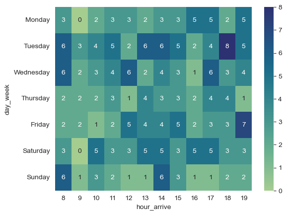
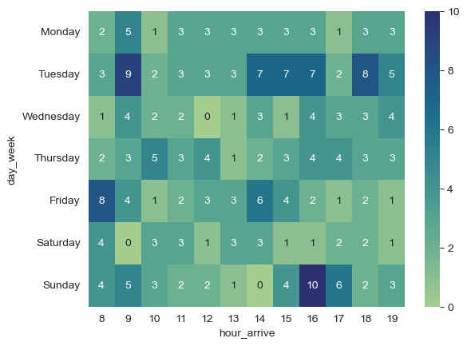
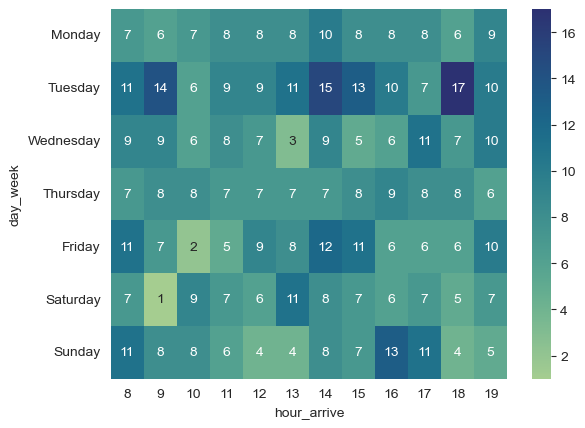
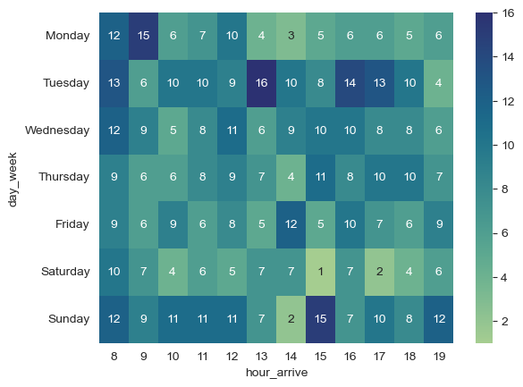
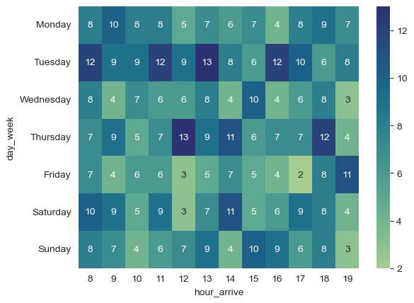
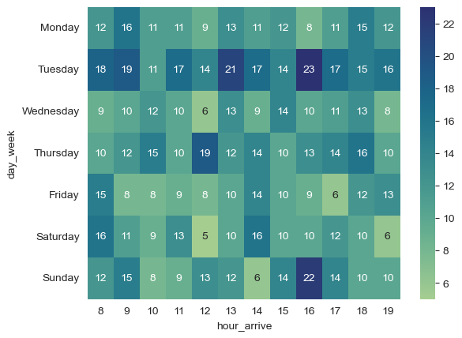
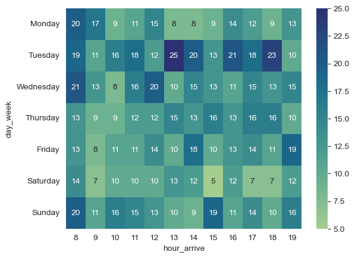

# Café Productivo: Análisis del Comportamiento de Clientes en un Espacio de Trabajo y Estudio

## Objetivo General:

Analizar el comportamiento de los clientes en una cafetería enfocada en estudio y trabajo para optimizar desiciones
relacionadas con el menú horarios, disposición del espacio y promociones.

### Tecnologías usadas en el análisis:

- Python 3.12
- Pandas
- Datetime
- Seaborn
- Sklearn
- KMeans

## Preguntas guía del análisis

1. ¿En qué horarios hay mayor afluencia de personas trabajando o estudiando?
2. ¿Qué productos se consumen más durante sesiones de estudio/trabajo?
3. ¿Cuál es el tiempo promedio de estancia de los distintos tipos de clientes?
4. ¿Las ventas cambian si hay eventos como lluvias, exámenes universitarios, etc.?
5. ¿Qué diferencias hay entre clientes individuales y grupos (reuniones)?
6. ¿Hay correlación entre consumo de cafeína y duración de la visita?
7. ¿Cuáles son los días más rentables y por qué?

## Análisis

### 1. ¿En qué horarios hay mayor afluencia de personas trabajando o estudiando?
En el análisis se vio que hay mayor cantidad de gente que viene a nuestro café de manera individual que de manera
grupal o en pareja. Esto debido a que por ejemplo en un solo día en total dentro de una hora, el conjunto de personal
que viene de manera grupal y en pareja sumados no alcanza a las personas que viene de manera individual, por lo que
de antemano ya sabemos quien es nuestro público objetivo, los que vienen de manera individual.

A continuación se presentan los horarios de ocupación a partir de su tipo de visita y su propósito:

- Tipo de visita en 'grupo' y con un propósito de 'trabajar':

 
-  Tipo de visita en 'grupo' y con un propósito de 'estudiar':

- Tipo de visita en 'grupo' en general:

- Tipo de visita en 'pareja' y con propósito de 'trabajar':

- Tipo de visita en 'pareja' y con propósito de 'estudiar':

- Tipo de visita en 'pareja':

- Tipo de visita 'individual' y con propósito de 'trabajar':

- Tipo de visita 'individual' y con propósito de 'estudiar':

- Visita con un propósito de 'estudiar':

- Visita con un propósito de 'trabajar':

De manera general podemos ver a simple vista que uno de los días más ocupados es el martes, y que conforme se va
viendo las imágenes, se va viendo que se van ocupando poco a poco, por lo que podemos análizar que los grupos no nos
frecuentan tanto, luego le sigue las parejas, y en seguida los individuales, por lo que aquí se vuelve a apreciar
que nuestro público objetivo son las personas que vienen de manera individual, y que a su vez, las personas vienen
más a estudiar que ha trabajar

### 2. ¿Qué productos se consumen más durante sesiones de estudio/trabajo?

En los dos análisis se ve que no tienen mucha diferencia, pero si le prestamos más atención se podrán sacar varias
conclusiones de esas tablas:

- Productos que más se consumen cuando la gente va a estudiar:

| Producto       | Precio | Cantidad | %_cantidad | %_ingresos |
|----------------|--------|----------|------------|------------|
| Ensalada       | 5.0    | 233      | 11.61      | 17.00      |
| Sándwich       | 4.5    | 206      | 10.26      | 13.53      |
| Smoothie       | 4.0    | 216      | 10.76      | 12.61      |
| Tarta de queso | 3.5    | 232      | 11.56      | 11.85      |
| Café con leche | 3.0    | 267      | 13.30      | 11.69      |
| Capuchino      | 3.2    | 225      | 11.21      | 10.51      |
| Té verde       | 2.8    | 196      | 9.77       | 8.01       |
| Café americano | 2.5    | 215      | 10.71      | 7.84       |
| Croissant      | 2.2    | 217      | 10.81      | 6.97       |

- Productos que más se consumen cuando la gente va a trabajar:

| Producto       | Precio | Cantidad | %_cantidad | %_ingresos |
|----------------|--------|----------|------------|------------|
| Ensalada       | 5.0    | 239      | 10.64      | 15.71      |
| Sándwich       | 4.5    | 236      | 10.50      | 13.96      |
| Smoothie       | 4.0    | 240      | 10.68      | 12.62      |
| Tarta de queso | 3.5    | 254      | 11.30      | 11.69      |
| Café con leche | 3.0    | 269      | 11.97      | 10.61      |
| Capuchino      | 3.2    | 240      | 10.68      | 10.10      |
| Té verde       | 2.8    | 272      | 12.11      | 10.01      |
| Café americano | 2.5    | 239      | 10.64      | 7.85       |
| Croissant      | 2.2    | 258      | 11.48      | 7.46       |

Aquí ya podemos ver varias similitudes, ya que vemos que todos estos productos están en el mismo orden, la primera
podemos ver los productos que más consumen la gente que va a estudiar, y la segunda podemos ver a los que van a
trabajar.

Esto se debe a que los productos por la cantidad en que se piden y por su precio, proporcionan una gran cantidad de
ingresos para el café, sin embargo, esto crea cierta relación y vacío, se trataría de hacer que ciertos productos
baratos hacerlos más rentables para el negocio, aunque no se ve tan necesario, debido a que se ve muy diversificado los
ingresos con un promedio de 10% de ingresos del café por producto.

### 3. ¿Cuál es el tiempo promedio de estancia de los distintos tipos de clientes?

Se investigó detalladamente acerca del tiempo promedio de los distintos tipo de clientes, ya que esto ayudaría a crear
menús adecuados a cada cliente, debido a que se crearían especializados para cada uno de acuerdo a sus necesidades.

| Tipo de cliente | Tiempo (minutos) |
|-----------------|------------------|
| Individual      | 89               |
| Pareja          | 90               |
| Grupo           | 88               |

Hay una diferencia entre cada uno de ellos de 1 minuto, no hay demasiado tiempo de desviación, y realmente sorprendieron
los resultados, nosotros esperábamos que el individual estuviera mucho menos tiempo y que el grupo estuviera mucho más
tiempo, pero sorprendió, ya que no hay practicamente nada de diferencia.}

### 4. ¿Las ventas cambian si hay eventos como lluvias, exámenes universitarios, etc.?

De igual manera, el clima afecta bastante en las ventas, uno esperaría que por ser lluvioso o nublado se antoje más un
café, pero nuestro análisis arrojo los siguientes resultados:

| Clima    | Ventas ($) |
|----------|------------|
| Soleado  | $ 10168.9  |
| Nublado  | $ 6352.9   |
| Lluvioso | $ 1543.8   |

Los resultados arrojaron que el clima soleado tiene más ventas, puede ser porque a la gente local le gusta más ese
clima, puede ser también por la región, porque puede que no llueva o se nuble tan seguido; sin embargo, hay que tener
más atención en climas soleados porque hay mayores ventas, a diferencia de los otros climas.

### 5. ¿Qué diferencias hay entre clientes individuales y grupos (reuniones)?

Todos los datos son muy parecidos, lo único que cambia son los dispositivos conectados, esto es muy obvio ya que como
más personas van al lugar, se necesitan más conectores, pero por otra diferencia, no hay otra.

### 6. ¿Hay correlación entre consumo de cafeína y duración de la visita?

Realmente no hay diferencia, debido a que el rango es de 3 minutos, el máximo es de 91 minutos con el Croissant, y el
mínimo es la ensalada con 88 minutos.

### 7. ¿Cuáles son los días más rentables y por qué?

Aquí hay mucha diferencia debido a que el día que más ventas tiene es el martes con 7478 pesos, y el viernes es el día
con 5108 pesos, una diferencia de 2000 pesos, eso pone como estrategia tratar de incrementar las ventas los viernes,
ofreciendo descuentos, 2x2, etc.